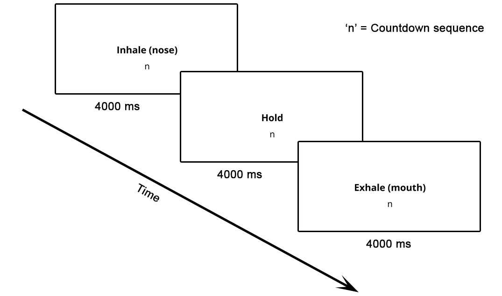
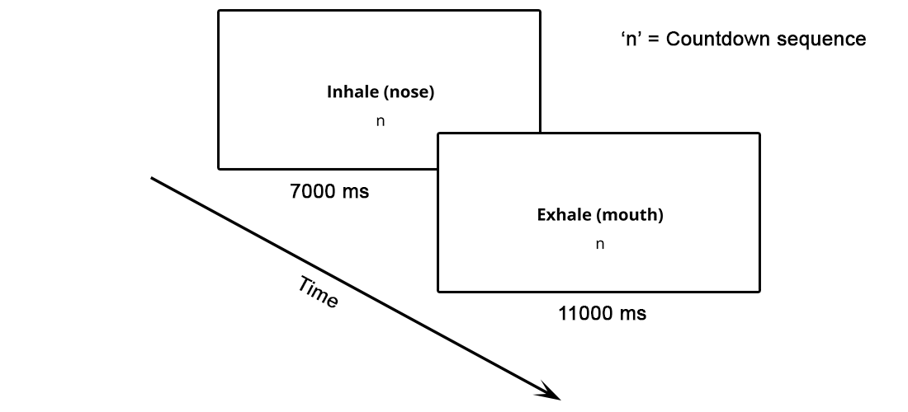

# jsPsych-Breathing-Exercises
<b>A jsPsych breathing exercise implementation created to assist users in carrying out deep breathing techniques, with relevant applications across personal mindfulness practice and research paradigms.</b>

[Try the implementation](https://oliveracollins.github.io/jsPsych-Breathing-Exercises/)

❗**WARNING:**
If you begin to experience dizziness, air hunger, pain, or any other adverse effects when practicing deep breathing techniques, <b>immediately</b> STOP engaging with the exercise.

## Rationale
The primary reason for wanting to code this implementation was to produce reliable breathwork exercises to be used in a controlled research environment.

## How does this implementation <i>actually</i> assist users?
- Users are provided with distinct exercises to choose from (more on this under the next heading)
- For each exercise, users are given different lengths to select from
- Instructions are provided on how to effectively engage with each exercise within the parameters of this technology-assisted setup
- In each breathing exercise, a real time countdown sequence is provided for every step of the cycle
- This implementation is available via an easily-accesible webpage!

## What breathing exercises are included in this implementation?
### 4-7-8 breathing
There are two different lengths of 4-7-8 breathing included: <b>4x</b> cycles and <b>8x</b> cycles. If you are a novice to this breathing practice, it is <b>strongly advised</b> that you start out with the 4x cycles version. This is due to the likelihood of experiencing adverse physiological side effects (dizziness, fainting, discomfort) when undertaking 8x cycles due to the strong parasympathetic intensity of 4-7-8 breathing.

<figure>
 
 <figcaption><i>A representation of one cycle of 4-7-8 breathing</i></figcaption>
</figure>

### Box breathing
There are four different lengths of box breathing included: <b>short</b> (2 minutes), <b>medium</b> (5 minutes), <b>long</b> (10 minutes), and <b>longer</b> (20 minutes). If you are new to box breathing, it is suggested that you start out on either the short- or medium-length exercises.

<figure>
 
<figcaption><i>A representation of one cycle of box breathing</i></figcaption>
</figure>

### 7-11 breathing
There are four different lengths of 7-11 breathing included: <b>short</b> (2 minutes), <b>medium</b> (5 minutes), <b>long</b> (10 minutes), and <b>longer</b> (20 minutes). Just like with box breathing, if you are new to deep breathing practices, it is suggested that you start out on either the short- or medium-length 7-11 exercises.

<figure>
 
<figcaption><i>A representation of one cycle of 7-11 breathing</i></figcaption>
</figure>

## Potential limitations and caveats
At least three possible drawbacks of using this implementation can be identified, which may contribute to an attenuation of the benefits of engaging with breathing exercises:
- Firstly, this implementation "counts" the steps included in each exercise cycle for the user. It may be that the action of counting each step <i>by oneself</i> is actually an important component of engaging with breathing techniques
- Second of all, mindfulness practices are typically utilised in an endeavour to escape stimulation and the fast-paced nature of one's external environment. If breathing exercises are performed using a computer, and especially in a lab environment, this may not provide a setting conducive to reducing such stimulation. Relatedly, it could also be that <i>watching</i> these counts is suboptimal, where otherwise closing one's eyes may produce more favourable outcomes
- Thirdly, this implementation encourages the user to sit down whilst performing their deep breathing. This neglects those who may prefer to lay down or stand up whilst engaging in mindfulness

*If any issues occur within this implementation, please open an [Issue](https://github.com/OliverACollins/jsPsych-Breathing-Exercises/issues) so that any problems highlighted can be addressed. Thank you!*